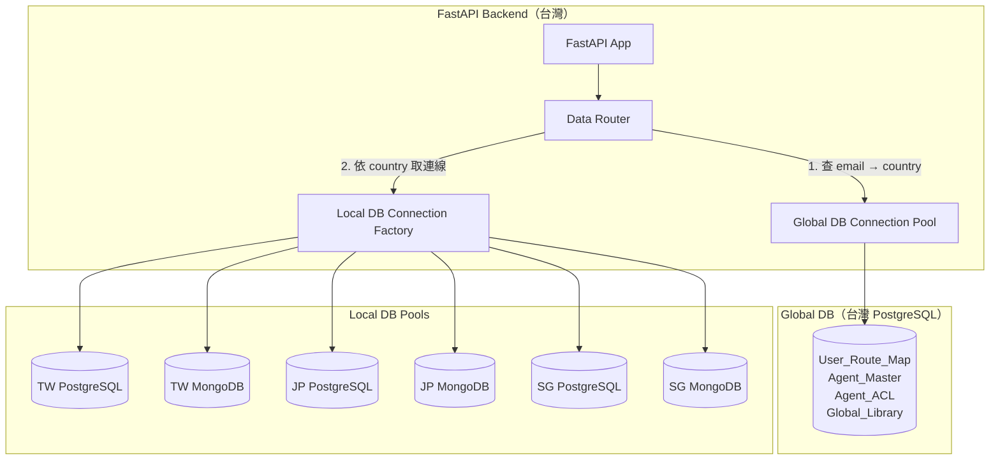
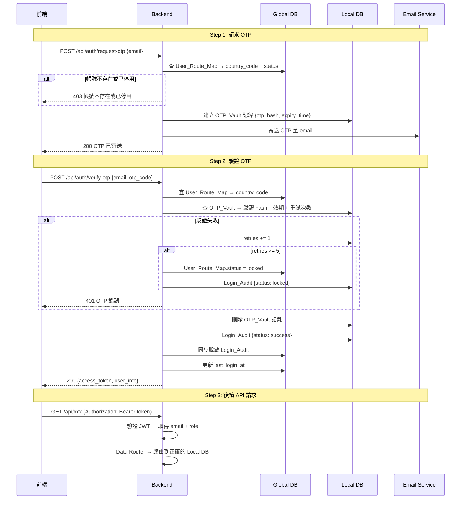
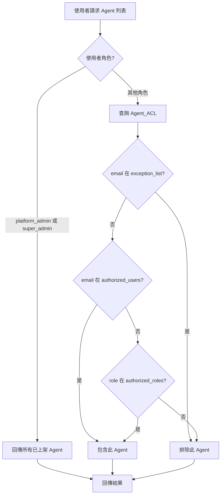
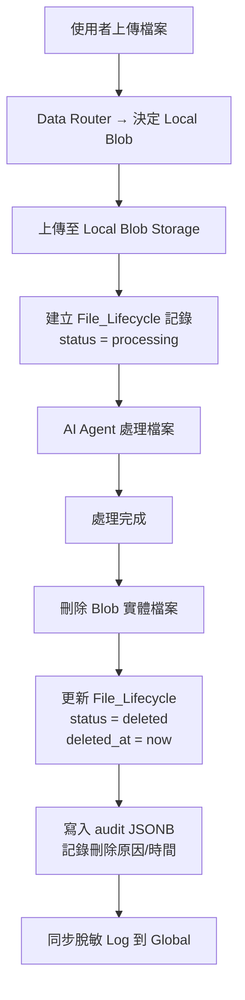

# CTBC AI Portal — 後端架構設計文件

## 1. 技術棧

| 層級 | 技術選型 | 說明 |
|------|----------|------|
| Web Framework | FastAPI (Python 3.11+) | 非同步高效能 API 框架 |
| ORM / DB Driver | SQLAlchemy 2.0 (async) + asyncpg | Global DB & Local PostgreSQL |
| MongoDB Driver | Motor (async) | Local MongoDB 非結構化資料 |
| 認證 | python-jose (JWT) + OTP | Email OTP 登入 + JWT Session |
| 郵件發送 | aiosmtplib / Azure Communication Services | OTP 寄送 |
| Blob Storage | azure-storage-blob (async) | 檔案上傳/下載/刪除 |
| 密碼雜湊 | passlib + bcrypt | OTP Hash |
| 資料驗證 | Pydantic v2 | Request/Response Schema |
| CORS | FastAPI CORSMiddleware | 前端跨域存取 |
| 環境變數 | python-dotenv | 設定管理 |

---

## 2. 專案目錄結構

```
Azure/backend/
├── main.py                     # FastAPI 應用程式入口
├── config.py                   # 環境變數與設定
├── requirements.txt            # Python 依賴
├── .env.example                # 環境變數範例
├── Dockerfile                  # 容器化部署
│
├── core/                       # 核心模組
│   ├── __init__.py
│   ├── database.py             # Global DB 連線 (PostgreSQL)
│   ├── local_database.py       # Local DB 連線工廠 (PostgreSQL + MongoDB)
│   ├── data_router.py          # 資料路由：依 country_code 決定 DB 連線
│   ├── security.py             # JWT 產生/驗證、OTP 產生/驗證
│   └── permissions.py          # 角色權限定義與檢查
│
├── models/                     # SQLAlchemy / Pydantic Models
│   ├── __init__.py
│   ├── global_models.py        # Global DB: User_Route_Map, Agent_Master, Agent_ACL, Global_Library
│   ├── local_models.py         # Local DB: OTP_Vault, Login_Audit, Local_Notice, File_Lifecycle
│   └── schemas.py              # Pydantic Request/Response Schemas
│
├── api/                        # API 路由
│   ├── __init__.py
│   ├── auth_api.py             # 認證：OTP 申請/驗證/登入/登出
│   ├── user_api.py             # 使用者管理：CRUD + 角色指派 + 停用/啟用
│   ├── agent_api.py            # Agent：列表/上架/下架/ACL 管理
│   ├── announcement_api.py     # 公告：CRUD + 發布/取消發布
│   ├── library_api.py          # 圖書館：文件 CRUD + 權限設定 + 上傳/下載
│   ├── chat_api.py             # 對話：建立/取得/歷史
│   ├── file_api.py             # 檔案：上傳/處理/刪除生命週期
│   └── audit_api.py            # 稽核：Log 查詢（跨國 Log 僅 Super Admin）
│
├── services/                   # 業務邏輯層
│   ├── __init__.py
│   ├── auth_service.py         # OTP 產生/驗證/帳號鎖定邏輯
│   ├── user_service.py         # 使用者 CRUD 業務邏輯
│   ├── agent_service.py        # Agent 授權檢查邏輯
│   ├── announcement_service.py # 公告業務邏輯
│   ├── library_service.py      # 圖書館業務邏輯
│   ├── chat_service.py         # 對話儲存/查詢邏輯
│   ├── file_service.py         # 檔案生命週期管理
│   ├── audit_service.py        # 稽核日誌記錄 + 脫敏同步
│   └── blob_service.py         # Azure Blob Storage 操作
│
├── middleware/                  # 中介層
│   ├── __init__.py
│   ├── auth_middleware.py       # JWT 驗證中介層
│   └── audit_middleware.py      # 自動稽核記錄中介層
│
└── utils/                      # 工具函式
    ├── __init__.py
    ├── otp_utils.py            # OTP 產生/Hash 工具
    └── sanitize_utils.py       # 資料脫敏工具
```

---

## 3. 資料庫連線架構



### 3.1 Data Router 核心邏輯

```python
# core/data_router.py 概念
class DataRouter:
    async def get_local_pg(self, email: str) -> AsyncSession:
        """依 email 查 User_Route_Map → 取得對應國家的 PostgreSQL 連線"""
        country = await self.get_country(email)
        return self.local_pg_pools[country]

    async def get_local_mongo(self, email: str) -> AsyncIOMotorDatabase:
        """依 email 查 User_Route_Map → 取得對應國家的 MongoDB 連線"""
        country = await self.get_country(email)
        return self.local_mongo_clients[country]

    async def get_local_blob(self, email: str) -> ContainerClient:
        """依 email → 取得對應國家的 Blob Storage 連線"""
        country = await self.get_country(email)
        return self.blob_clients[country]
```

---

## 4. 認證流程



### JWT Token 結構

```json
{
  "sub": "tina@ctbc.com",
  "role": "platform_admin",
  "country": "TW",
  "exp": 1709500000,
  "iat": 1709496400
}
```

---

## 5. 角色權限系統

### 5.1 角色定義

```python
# core/permissions.py
from enum import Enum

class Role(str, Enum):
    SUPER_ADMIN = "super_admin"
    PLATFORM_ADMIN = "platform_admin"
    USER_MANAGER = "user_manager"
    LIBRARY_MANAGER = "library_manager"
    USER = "user"

ROLE_PERMISSIONS = {
    Role.SUPER_ADMIN: [
        "view_announcements", "use_agents", "view_library", "chat_history",
        "manage_users", "manage_library", "manage_announcements",
        "manage_agent_permissions", "access_all_agents", "access_all_docs",
        "cross_country_logs",
    ],
    Role.PLATFORM_ADMIN: [
        "view_announcements", "use_agents", "view_library", "chat_history",
        "manage_users", "manage_library", "manage_announcements",
        "manage_agent_permissions", "access_all_agents", "access_all_docs",
    ],
    Role.USER_MANAGER: [
        "view_announcements", "use_agents", "view_library", "chat_history",
        "manage_users",
    ],
    Role.LIBRARY_MANAGER: [
        "view_announcements", "use_agents", "view_library", "chat_history",
        "manage_library",
    ],
    Role.USER: [
        "view_announcements", "use_agents", "view_library", "chat_history",
    ],
}
```

### 5.2 權限裝飾器

```python
# 使用方式
@router.get("/api/users")
@require_permission("manage_users")
async def list_users(current_user: User = Depends(get_current_user)):
    ...

@router.get("/api/audit/cross-country")
@require_permission("cross_country_logs")
async def get_cross_country_logs(current_user: User = Depends(get_current_user)):
    ...
```

### 5.3 Global DB 新增欄位

`User_Route_Map` 表需新增 `role` 欄位：

```sql
ALTER TABLE user_route_map ADD COLUMN role VARCHAR(20) DEFAULT 'user';
-- 可選值: super_admin, platform_admin, user_manager, library_manager, user
```

---

## 6. API 規格

### 6.1 認證 API

| Method | Path | 說明 | 權限 |
|--------|------|------|------|
| POST | `/api/auth/request-otp` | 請求 OTP | 公開 |
| POST | `/api/auth/verify-otp` | 驗證 OTP → 回傳 JWT | 公開 |
| POST | `/api/auth/logout` | 登出（前端清除 token） | 已登入 |
| GET | `/api/auth/me` | 取得當前使用者資訊 | 已登入 |

### 6.2 使用者管理 API

| Method | Path | 說明 | 權限 |
|--------|------|------|------|
| GET | `/api/users` | 使用者列表 | manage_users |
| POST | `/api/users` | 新增使用者 | manage_users |
| PUT | `/api/users/{email}` | 編輯使用者 | manage_users |
| PATCH | `/api/users/{email}/status` | 停用/啟用帳號 | manage_users |
| PATCH | `/api/users/{email}/role` | 角色指派 | manage_users |

### 6.3 Agent API

| Method | Path | 說明 | 權限 |
|--------|------|------|------|
| GET | `/api/agents` | 取得可用 Agent 列表（依授權過濾） | use_agents |
| GET | `/api/agents/all` | 取得所有 Agent（管理用） | manage_agent_permissions |
| PUT | `/api/agents/{agent_id}/publish` | 上架/下架 | manage_agent_permissions |
| PUT | `/api/agents/{agent_id}/acl` | 更新授權規則 | manage_agent_permissions |

### 6.4 公告 API

| Method | Path | 說明 | 權限 |
|--------|------|------|------|
| GET | `/api/announcements` | 取得公告列表（已發布） | view_announcements |
| GET | `/api/announcements/all` | 取得所有公告（含未發布） | manage_announcements |
| POST | `/api/announcements` | 新增公告 | manage_announcements |
| PUT | `/api/announcements/{id}` | 編輯公告 | manage_announcements |
| DELETE | `/api/announcements/{id}` | 刪除公告 | manage_announcements |

### 6.5 圖書館 API

| Method | Path | 說明 | 權限 |
|--------|------|------|------|
| GET | `/api/library` | 取得圖書館列表（依授權過濾） | view_library |
| GET | `/api/library/all` | 取得所有文件（管理用） | manage_library |
| POST | `/api/library/upload` | 上傳文件至台灣 Blob | manage_library |
| DELETE | `/api/library/{doc_id}` | 刪除文件 | manage_library |
| PUT | `/api/library/{doc_id}/auth` | 更新文件授權規則 | manage_library |
| GET | `/api/library/{doc_id}/download` | 下載文件 | view_library（需授權） |

### 6.6 對話 API

| Method | Path | 說明 | 權限 |
|--------|------|------|------|
| POST | `/api/chat` | 發送訊息（存入 Local MongoDB） | use_agents |
| GET | `/api/chat/history` | 取得對話歷史列表 | chat_history |
| GET | `/api/chat/{chat_id}` | 取得單一對話詳情 | chat_history |

### 6.7 檔案 API

| Method | Path | 說明 | 權限 |
|--------|------|------|------|
| POST | `/api/files/upload` | 上傳檔案至 Local Blob | use_agents |
| GET | `/api/files/{file_id}/status` | 查詢檔案處理狀態 | use_agents |

### 6.8 稽核 API

| Method | Path | 說明 | 權限 |
|--------|------|------|------|
| GET | `/api/audit/logs` | 查詢本國稽核日誌 | manage_users 或 platform_admin |
| GET | `/api/audit/cross-country` | 跨國 Log 查詢 | cross_country_logs |

---

## 7. 資料庫 Schema（SQL）

### 7.1 Global DB（台灣 PostgreSQL）

```sql
-- 使用者路由映射（新增 role, name, department 欄位）
CREATE TABLE user_route_map (
    email VARCHAR(255) PRIMARY KEY,
    name VARCHAR(100) NOT NULL,
    department VARCHAR(100),
    country_code VARCHAR(5) NOT NULL,
    role VARCHAR(20) NOT NULL DEFAULT 'user',
    status VARCHAR(20) NOT NULL DEFAULT 'active',  -- active / inactive / locked
    last_login_at TIMESTAMP WITH TIME ZONE,
    created_at TIMESTAMP WITH TIME ZONE DEFAULT NOW(),
    updated_at TIMESTAMP WITH TIME ZONE DEFAULT NOW()
);

-- Agent 主表
CREATE TABLE agent_master (
    agent_id UUID PRIMARY KEY DEFAULT gen_random_uuid(),
    name VARCHAR(255) NOT NULL,
    model_config JSONB NOT NULL DEFAULT '{}',
    icon VARCHAR(10),
    color VARCHAR(10),
    description TEXT,
    quota INTEGER DEFAULT 0,
    is_published BOOLEAN DEFAULT FALSE,
    created_at TIMESTAMP WITH TIME ZONE DEFAULT NOW(),
    updated_at TIMESTAMP WITH TIME ZONE DEFAULT NOW()
);

-- Agent 存取控制
CREATE TABLE agent_acl (
    agent_id UUID PRIMARY KEY REFERENCES agent_master(agent_id) ON DELETE CASCADE,
    allowed_users JSONB NOT NULL DEFAULT '{
        "authorized_roles": [],
        "authorized_users": [],
        "exception_list": []
    }'
);

-- 全域圖書館
CREATE TABLE global_library (
    doc_id UUID PRIMARY KEY DEFAULT gen_random_uuid(),
    library_name VARCHAR(255) NOT NULL,
    name VARCHAR(255) NOT NULL,
    metadata JSONB NOT NULL DEFAULT '{}',
    auth_rules JSONB NOT NULL DEFAULT '{
        "authorized_roles": [],
        "authorized_users": [],
        "exception_list": []
    }',
    file_url TEXT,
    created_at TIMESTAMP WITH TIME ZONE DEFAULT NOW(),
    updated_at TIMESTAMP WITH TIME ZONE DEFAULT NOW()
);

-- 脫敏稽核日誌（從各國同步）
CREATE TABLE global_audit_log (
    log_id UUID PRIMARY KEY DEFAULT gen_random_uuid(),
    user_email VARCHAR(255),
    action VARCHAR(100) NOT NULL,
    target VARCHAR(255),
    country_code VARCHAR(5),
    timestamp TIMESTAMP WITH TIME ZONE DEFAULT NOW()
);

-- 索引
CREATE INDEX idx_user_route_map_country ON user_route_map(country_code);
CREATE INDEX idx_user_route_map_role ON user_route_map(role);
CREATE INDEX idx_user_route_map_status ON user_route_map(status);
CREATE INDEX idx_agent_master_published ON agent_master(is_published);
CREATE INDEX idx_global_library_name ON global_library(library_name);
CREATE INDEX idx_global_audit_log_email ON global_audit_log(user_email);
CREATE INDEX idx_global_audit_log_timestamp ON global_audit_log(timestamp);
```

### 7.2 Local DB（各國 PostgreSQL）

```sql
-- OTP 保險庫
CREATE TABLE otp_vault (
    email VARCHAR(255) PRIMARY KEY,
    otp_hash VARCHAR(255) NOT NULL,
    expiry_time TIMESTAMP WITH TIME ZONE NOT NULL,
    retries INTEGER DEFAULT 0,
    created_at TIMESTAMP WITH TIME ZONE DEFAULT NOW()
);

-- 登入稽核
CREATE TABLE login_audit (
    id UUID PRIMARY KEY DEFAULT gen_random_uuid(),
    email VARCHAR(255) NOT NULL,
    status VARCHAR(20) NOT NULL,  -- success / failed / locked
    ip_address VARCHAR(45),
    user_agent TEXT,
    timestamp TIMESTAMP WITH TIME ZONE DEFAULT NOW()
);

-- 本地公告
CREATE TABLE local_notice (
    notice_id UUID PRIMARY KEY DEFAULT gen_random_uuid(),
    subject VARCHAR(255) NOT NULL,
    content_en TEXT,
    files JSONB DEFAULT '[]',
    publish_status VARCHAR(20) DEFAULT 'draft',  -- draft / published
    created_at TIMESTAMP WITH TIME ZONE DEFAULT NOW(),
    updated_at TIMESTAMP WITH TIME ZONE DEFAULT NOW()
);

-- 檔案生命週期
CREATE TABLE file_lifecycle (
    file_id UUID PRIMARY KEY DEFAULT gen_random_uuid(),
    email VARCHAR(255) NOT NULL,
    original_name VARCHAR(500) NOT NULL,
    blob_path TEXT,
    status VARCHAR(20) NOT NULL DEFAULT 'processing',  -- processing / deleted
    deleted_at TIMESTAMP WITH TIME ZONE,
    audit JSONB DEFAULT '{}',
    created_at TIMESTAMP WITH TIME ZONE DEFAULT NOW()
);

-- 索引
CREATE INDEX idx_login_audit_email ON login_audit(email);
CREATE INDEX idx_login_audit_timestamp ON login_audit(timestamp);
CREATE INDEX idx_local_notice_status ON local_notice(publish_status);
CREATE INDEX idx_file_lifecycle_email ON file_lifecycle(email);
CREATE INDEX idx_file_lifecycle_status ON file_lifecycle(status);
```

### 7.3 Local DB（各國 MongoDB）

```javascript
// Chat_Store Collection
{
    chat_id: ObjectId,
    user_email: "user@ctbc.com",
    agent_id: "uuid-string",
    title: "對話標題（自動產生）",
    messages: [
        { role: "user", content: "...", timestamp: ISODate() },
        { role: "assistant", content: "...", timestamp: ISODate() }
    ],
    created_at: ISODate(),
    updated_at: ISODate()
}

// System_Audit_Logs Collection
{
    log_id: ObjectId,
    user_email: "user@ctbc.com",
    action: "login_success",
    target: "auth",
    details: { ... },
    location: "TW",
    timestamp: ISODate()
}
```

---

## 8. 關鍵業務流程

### 8.1 Agent 授權檢查



### 8.2 檔案生命週期



---

## 9. 環境變數設計

```env
# === 應用程式 ===
APP_ENV=development
APP_PORT=8080
APP_SECRET_KEY=your-secret-key-here
JWT_EXPIRE_MINUTES=480
OTP_EXPIRE_MINUTES=10
OTP_MAX_RETRIES=5

# === Global DB (台灣 PostgreSQL) ===
GLOBAL_DB_HOST=localhost
GLOBAL_DB_PORT=5432
GLOBAL_DB_NAME=ctbc_global
GLOBAL_DB_USER=postgres
GLOBAL_DB_PASSWORD=password

# === Local DB 連線 (JSON 格式，支援多國) ===
LOCAL_DB_CONFIG='{
  "TW": {
    "pg_host": "tw-pg.postgres.database.azure.com",
    "pg_port": 5432,
    "pg_db": "ctbc_local_tw",
    "pg_user": "admin",
    "pg_password": "xxx",
    "mongo_uri": "mongodb://tw-mongo.mongo.cosmos.azure.com:10255",
    "mongo_db": "ctbc_local_tw",
    "blob_connection_string": "DefaultEndpointsProtocol=https;...",
    "blob_container": "user-files"
  },
  "JP": { ... },
  "SG": { ... }
}'

# === 台灣 Blob Storage (靜態知識庫) ===
TW_BLOB_CONNECTION_STRING=DefaultEndpointsProtocol=https;...
TW_BLOB_CONTAINER=knowledge-library

# === Email Service ===
SMTP_HOST=smtp.office365.com
SMTP_PORT=587
SMTP_USER=noreply@ctbc.com
SMTP_PASSWORD=xxx

# === CORS ===
CORS_ORIGINS=["https://portal.ctbc.com", "http://localhost:5173"]
```

---

## 10. 實作優先順序（Todo List）

### Phase 1: 基礎架構
- [ ] 建立專案骨架（目錄結構 + requirements.txt + config.py）
- [ ] 實作 Global DB 連線 + SQLAlchemy Models
- [ ] 實作 Local DB 連線工廠（PostgreSQL + MongoDB）
- [ ] 實作 Data Router（依 email → country 路由）

### Phase 2: 認證系統
- [ ] 實作 OTP 產生/Hash/驗證邏輯
- [ ] 實作 POST /api/auth/request-otp
- [ ] 實作 POST /api/auth/verify-otp（含 JWT 產生）
- [ ] 實作 JWT 驗證中介層
- [ ] 實作 GET /api/auth/me

### Phase 3: 角色權限
- [ ] 實作角色定義 + 權限裝飾器
- [ ] 實作使用者管理 API（CRUD + 角色指派 + 停用/啟用）

### Phase 4: 業務功能
- [ ] 實作公告 API（CRUD + 發布控制）
- [ ] 實作 Agent API（列表 + 上架/下架 + ACL）
- [ ] 實作圖書館 API（文件 CRUD + 權限 + 上傳/下載）
- [ ] 實作對話 API（建立/歷史/詳情）
- [ ] 實作檔案生命週期 API（上傳/處理/刪除）

### Phase 5: 稽核與安全
- [ ] 實作稽核中介層（自動記錄操作）
- [ ] 實作脫敏同步（Local → Global）
- [ ] 實作稽核 API（本國 + 跨國 Log）

### Phase 6: 整合
- [ ] 前端 API 串接（替換 mockData）
- [ ] Blob Storage 整合
- [ ] Email Service 整合
- [ ] Docker 容器化

---

## 11. 安全考量

1. **OTP 安全**：使用 bcrypt Hash，不存明文；10 分鐘過期；5 次錯誤鎖定
2. **JWT 安全**：HS256 簽名；8 小時過期；包含 role + country
3. **資料隔離**：Data Router 強制路由，不可跨區存取
4. **權限檢查**：每個 API 端點都有 `@require_permission` 裝飾器
5. **稽核追蹤**：所有關鍵操作自動記錄到 System_Audit_Logs
6. **資料不落地**：台灣端不做任何使用者資料的本地持久化
7. **Log 脫敏**：同步到 Global 的 Log 僅保留「誰、做什麼、何時」，不含內容
