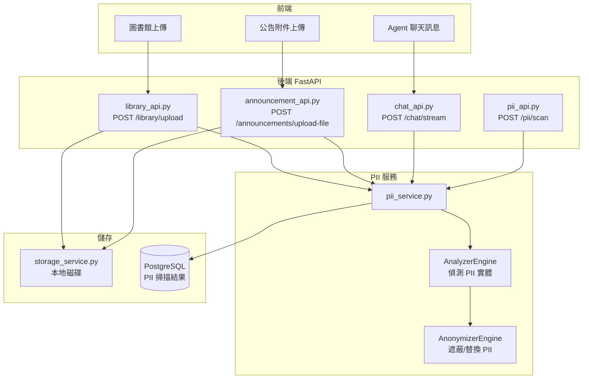
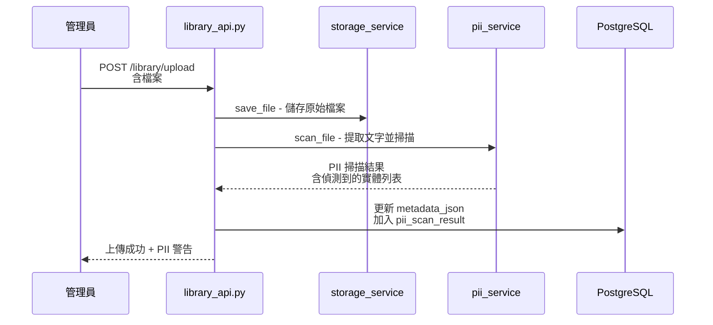
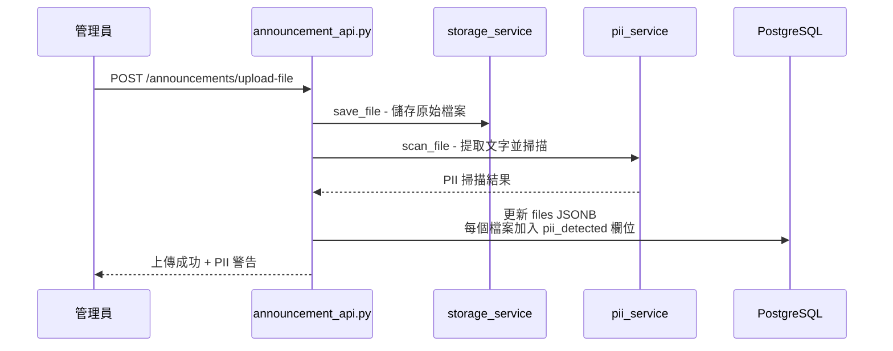
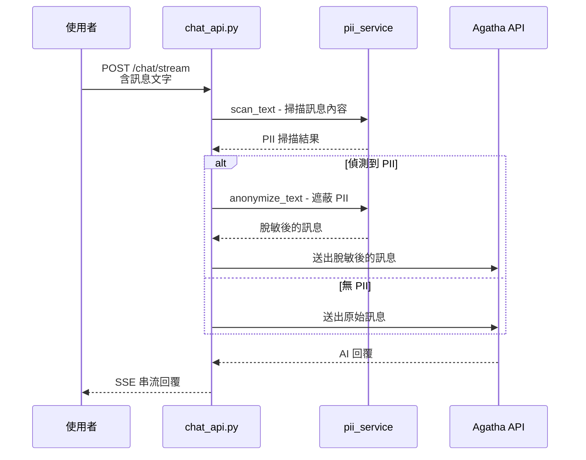

# PII Detection & Redaction — 整合設計文件

> **目標**：使用 Microsoft Presidio（開源 Python 框架）在後端建立 PII 掃描服務，整合到所有檔案上傳和聊天訊息流程中，自動偵測並遮蔽個人可識別資訊。

---

## 1. 架構概覽



## 2. 三個整合場景

### 場景 1：圖書館文件上傳



**行為**：
- 上傳時自動掃描，結果存入 `metadata_json.pii_scan`
- 不阻擋上傳（僅警告），管理員可決定是否繼續
- 下載時可選擇原始版或脫敏版

### 場景 2：公告附件上傳



### 場景 3：Agent 聊天訊息



**行為**：
- 聊天訊息在送入 Agatha API **之前**自動脫敏
- 使用者看到的是原始訊息，但送給 AI 的是脫敏版
- 對話歷史存原始訊息（內部系統，有權限控制）

## 3. PII 服務設計

### 3.1 核心服務：`services/pii_service.py`

```python
# 主要功能：
class PIIService:
    # 初始化 Presidio Analyzer + Anonymizer
    def __init__(self, languages, pii_enabled, confidence_threshold)
    
    # 掃描純文字，回傳偵測到的 PII 實體列表
    def scan_text(self, text: str) -> PIIScanResult
    
    # 遮蔽純文字中的 PII，回傳脫敏後的文字
    def anonymize_text(self, text: str) -> str
    
    # 從檔案提取文字並掃描（支援 PDF、DOCX、TXT、CSV）
    async def scan_file(self, file_path: Path) -> PIIScanResult
    
    # 產生脫敏版檔案（僅支援 TXT；PDF/DOCX 僅標記不修改）
    async def create_redacted_file(self, file_path: Path) -> Path | None
```

### 3.2 支援的 PII 類型

| PII 類型 | Presidio Entity | 說明 | 範例 |
|----------|----------------|------|------|
| 身分證字號 | CUSTOM: TW_ID | 台灣身分證 | A123456789 |
| 護照號碼 | CUSTOM: PASSPORT | 護照號碼 | 301234567 |
| 信用卡號 | CREDIT_CARD | 信用卡 | 4111-1111-1111-1111 |
| 銀行帳號 | IBAN_CODE / CUSTOM | 銀行帳號 | — |
| Email | EMAIL_ADDRESS | 電子郵件 | user@example.com |
| 電話號碼 | PHONE_NUMBER | 電話 | 0912-345-678 |
| 姓名 | PERSON | 人名 | 王小明 |
| 地址 | LOCATION | 地址 | 台北市信義區... |
| IP 位址 | IP_ADDRESS | IP | 192.168.1.1 |

### 3.3 自訂 Recognizer（台灣特有）

Presidio 內建主要支援英文/歐美格式，需要自訂以下 Recognizer：

1. **TW_ID_Recognizer** — 台灣身分證字號（字母 + 9 位數字，含驗證碼檢查）
2. **TW_PHONE_Recognizer** — 台灣手機/市話格式（09xx-xxx-xxx、02-xxxx-xxxx）
3. **TW_BANK_ACCOUNT_Recognizer** — 台灣銀行帳號格式

### 3.4 資料模型

```python
@dataclass
class PIIEntity:
    entity_type: str      # e.g. "EMAIL_ADDRESS", "TW_ID"
    text: str             # 偵測到的原始文字
    start: int            # 起始位置
    end: int              # 結束位置
    score: float          # 信心分數 0-1

@dataclass  
class PIIScanResult:
    has_pii: bool                    # 是否偵測到 PII
    entity_count: int                # PII 實體數量
    entities: list[PIIEntity]        # 偵測到的實體列表
    entity_types: list[str]          # 偵測到的 PII 類型（去重）
    scanned_at: datetime             # 掃描時間
    text_length: int                 # 掃描的文字長度
    confidence_threshold: float      # 使用的信心閾值
```

## 4. 設定項（config.py / .env）

```env
# PII 功能開關（預設關閉，方便開發環境跳過）
PII_ENABLED=true

# PII 掃描語言（逗號分隔）
PII_LANGUAGES=en,zh

# PII 信心閾值（0-1，越高越嚴格，建議 0.5-0.7）
PII_CONFIDENCE_THRESHOLD=0.5

# 聊天訊息是否自動脫敏後再送 AI（true = 脫敏後送，false = 僅掃描標記）
PII_CHAT_AUTO_REDACT=true

# PII 遮蔽方式：mask（用 *** 遮蔽）、replace（用 <PII_TYPE> 替換）、hash（雜湊）
PII_REDACT_MODE=replace
```

## 5. API 端點

### 5.1 獨立掃描 API（測試/管理用）

```
POST /api/pii/scan
Body: { "text": "我的身分證是A123456789，email是test@example.com" }
Response: {
    "has_pii": true,
    "entity_count": 2,
    "entities": [
        { "entity_type": "TW_ID", "text": "A123456789", "score": 0.95 },
        { "entity_type": "EMAIL_ADDRESS", "text": "test@example.com", "score": 0.99 }
    ],
    "redacted_text": "我的身分證是<TW_ID>，email是<EMAIL_ADDRESS>"
}
```

### 5.2 獨立脫敏 API

```
POST /api/pii/redact
Body: { "text": "我的身分證是A123456789" }
Response: {
    "original_text": "我的身分證是A123456789",
    "redacted_text": "我的身分證是<TW_ID>",
    "entities_found": 1
}
```

## 6. 整合點修改

### 6.1 `library_api.py` — 圖書館上傳

修改 `upload_document()` 和 `upload_file()`：
- 檔案儲存後，呼叫 `pii_service.scan_file()` 掃描
- 掃描結果存入 `metadata_json.pii_scan`
- 回傳訊息中包含 PII 警告

### 6.2 `announcement_api.py` — 公告附件上傳

修改 `upload_announcement_file()`：
- 檔案儲存後，呼叫 `pii_service.scan_file()` 掃描
- 掃描結果存入每個檔案的 `pii_detected` 欄位
- 回傳訊息中包含 PII 警告

### 6.3 `chat_api.py` — 聊天訊息

修改 `chat_stream()`：
- 在送出訊息給 Agatha API 之前，呼叫 `pii_service.scan_text()`
- 如果 `PII_CHAT_AUTO_REDACT=true`，用脫敏後的文字送給 AI
- 對話歷史仍存原始訊息
- SSE 事件中加入 `pii_warning` 欄位通知前端

## 7. 前端變更

### 7.1 圖書館/公告管理頁面
- 上傳成功後，如果回傳包含 PII 警告，顯示 `<Alert type="warning">` 提示
- 文件列表中，有 PII 的文件顯示警告圖示

### 7.2 聊天頁面
- 如果 SSE 事件包含 `pii_warning`，在訊息下方顯示小提示
- 可選：發送前預掃描（呼叫 `/api/pii/scan`），提醒使用者訊息含敏感資訊

## 8. 依賴套件

```
# requirements.txt 新增
presidio-analyzer==2.2.355
presidio-anonymizer==2.2.355
spacy==3.7.4

# spaCy 語言模型（需額外下載）
# python -m spacy download en_core_web_lg
# python -m spacy download zh_core_web_sm  (中文支援)
```

## 9. 檔案結構

```
Azure/backend/
├── services/
│   ├── storage_service.py      # 現有 — 檔案儲存
│   └── pii_service.py          # 新增 — PII 掃描/脫敏服務
├── api/
│   ├── library_api.py          # 修改 — 整合 PII 掃描
│   ├── announcement_api.py     # 修改 — 整合 PII 掃描
│   ├── chat_api.py             # 修改 — 整合 PII 掃描
│   └── pii_api.py              # 新增 — 獨立 PII 掃描 API
├── config.py                   # 修改 — 新增 PII 設定
├── main.py                     # 修改 — 註冊 pii_api router + 初始化
└── requirements.txt            # 修改 — 新增 presidio 依賴
```

## 10. 注意事項

1. **效能**：Presidio 初始化需要載入 spaCy 模型，首次啟動較慢（約 5-10 秒），之後掃描速度很快
2. **中文支援**：Presidio 對中文的 NER 支援有限，台灣身分證等需要自訂 Recognizer（正則表達式）
3. **檔案文字提取**：PDF 需要 `pdfplumber` 或 `PyPDF2`，DOCX 需要 `python-docx`
4. **非阻擋式**：PII 掃描結果僅作為警告，不阻擋上傳或發送（避免影響正常使用）
5. **功能開關**：`PII_ENABLED=false` 時完全跳過掃描，不影響現有功能
6. **安全性**：下載連結中不能包含 ctbc 或其他敏感資訊（已記錄在 continuation.md）

---

> **最後更新**：2026-03-11
